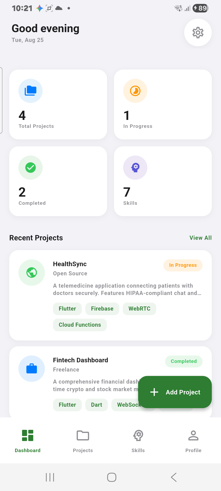
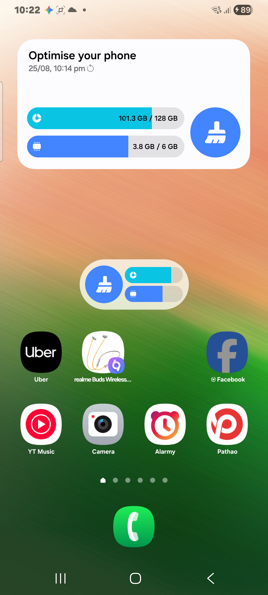
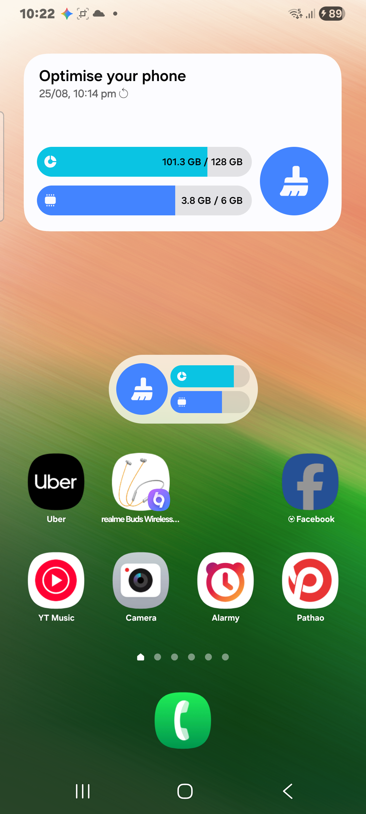
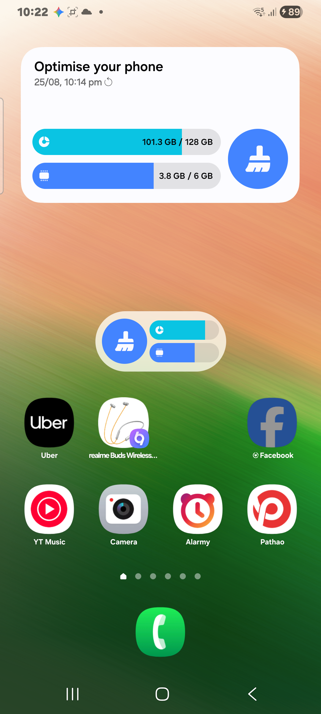

# 📱 CodeFolio Pro

<p align="center">
  
  &nbsp;&nbsp;
  
  &nbsp;&nbsp;
  
</p>

> **CodeFolio Pro** is a beautifully designed Flutter portfolio tracker app that helps developers showcase, manage, and track their projects and technical skills — all offline, no account required.

---

## ✨ Features

- 🏠 **Dashboard** — Personalized greeting, 4-metric stat grid, recent projects & top skills
- 📁 **Projects** — Full CRUD for your projects with status tracking, tech stack, GitHub & live demo links
- 🧠 **Skills** — Track your skills by category, proficiency level (Beginner → Expert), and years of experience
- 👤 **Profile** — Developer profile card with bio, GitHub, website links, and portfolio stats
- ⚙️ **Settings** — Dark/Light mode toggle, data reset, app info
- 🌙 **Dark Mode** — Full system dark mode support
- 💾 **100% Offline** — All data stored locally using SharedPreferences

---

## 📸 Screenshots

### Onboarding & Setup
<p>
  
</p>

### Main Screens
<p>
  
  &nbsp;
  
  &nbsp;
  
  &nbsp;
  
</p>

### Detail & Action Screens
<p>
  
  &nbsp;
  
  &nbsp;
  
</p>

---

## 🛠️ Tech Stack

| Technology | Purpose |
|---|---|
| **Flutter 3.47** | Cross-platform UI framework |
| **Dart 3.13** | Programming language |
| **Provider** | State management |
| **SharedPreferences** | Local offline storage |
| **url_launcher** | Open GitHub & website links |
| **Material 3** | Design system |

---

## 🚀 Getting Started

### Prerequisites
- Flutter SDK `>=3.0.0`
- Android Studio / VS Code
- Android or iOS device / emulator

### Installation

```bash
# Clone the repo
git clone https://github.com/anik1696/flutterProject.git

# Navigate to the project
cd flutterProject

# Install dependencies
flutter pub get

# Run the app
flutter run
```

---

## 📁 Project Structure

```
lib/
├── app/
│   ├── app.dart          # Root app widget + providers
│   ├── routes.dart       # Named route definitions
│   └── theme.dart        # Light & dark theme configuration
├── models/
│   ├── project.dart      # Project data model
│   ├── skill.dart        # Skill data model
│   └── user_profile.dart # User profile model
├── providers/
│   ├── project_provider.dart
│   ├── skill_provider.dart
│   ├── profile_provider.dart
│   └── theme_provider.dart
├── screens/
│   ├── splash_screen.dart
│   ├── onboarding_screen.dart
│   ├── dashboard_screen.dart
│   ├── projects_screen.dart
│   ├── skills_screen.dart
│   ├── profile_screen.dart
│   ├── project_details_screen.dart
│   ├── add_edit_project_screen.dart
│   └── settings_screen.dart
├── services/
│   ├── local_storage_service.dart
│   └── data_seeder.dart
└── widgets/
    ├── project_card.dart
    ├── skill_card.dart
    ├── metric_card.dart
    ├── tech_chip.dart
    ├── status_badge.dart
    └── empty_state.dart
```

---

## 👤 Developer

**Sahreyar Ahmed**
- GitHub: [@anik1696](https://github.com/anik1696)

---

## 📄 License

This project is open source and available under the [MIT License](LICENSE).
